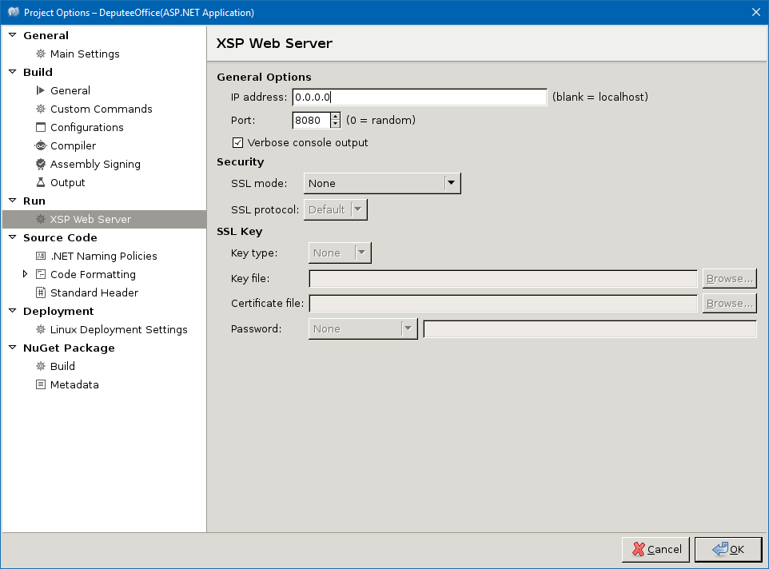
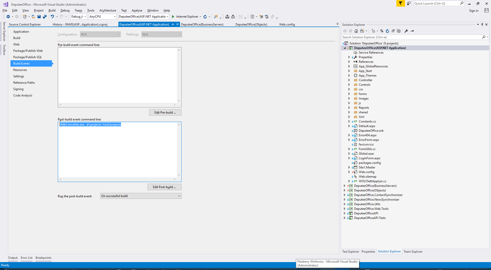

--- 
title: Recommendations for debugging 
keywords: Programming, Debug, Debuggings 
sidebar: guide-base-tech_sidebar 
toc: true 
permalink: en/gbt_debugging.html 
folder: guides/base-tech/debugging/ 
lang: en 
autotranslated: true 
hash: 6c44879f8b373189211e654bdaa8cca3a7be039ca9632c90534e051e7f81a23a 
--- 

## Debug 

### JavaScript Debugging and Ember.js using Chrome Web Tools 
When you develop a massive SPA most convenient to debug JavaScript code using the standard console of Google Chrome (Chrome Web Tools). 
 

App on Ember.js it is also convenient to debug using the addon [Ember Inspector](https://chrome.google.com/webstore/detail/ember-inspector/bmdblncegkenkacieihfhpjfppoconhi) 

#### the Most frequently used tab tool: 
* `Elements` — the HTML of the rendered page. 
* `Console` — JavaScript-console. The execution context of the command is the current context of the web application. That is, if the code is stopped (e.g. breakpoint), then the current context will be the place where execution of the program. It is very convenient. 
* `Sources` — file Explorer web page. Directly in this tab to debug JavaScript code. 
* `Network` — display network. With this tab you can conveniently track the communication between a client application and a backend. 
* `Ember` — if you use the addon [Ember Inspector](https://chrome.google.com/webstore/detail/ember-inspector/bmdblncegkenkacieihfhpjfppoconhi)in this tab in more detail, but at the same time, just to look "under the hood" of the framework: view all Routes of the application, information about the render chain Promises and so on. 

##### Debug code 
To debug JavaScript easiest to use **breakpoints** (_breakpoints_). A breakpoint can be put on a line of JavaScript code or, if necessary, you can stop the JS execution when a specific change in the DOM. This is done as follows in the tab `Elements`: 

 

Open JS file via DevTools by clicking `Ctrl P` and entering the name of the desired file, or you can manually find it in the tab `Sources`. You can then set a breakpoint by clicking the line number. Clicking RMB on breakpoint can be set, for example, to specify a stop condition. 

 

Using the right sidebar you can see the call stack (`Call Stack`) [3], set expressions for the tracking (`Watch`) [2]. In section `Scope` shows the contexts in section `Breakpoints` is a list of breakpoints that triggered a dedicated cotop. In the upper part of the sidebar are buttons step-by-step execution [1], click the ignore breakpoints button, which includes a stop execution when an exception occurs [6]. 

 

The values of the variables can be obtained using the console (tab `Console`) using `Watch` section of the right sidebar, or simply hovering the mouse over the variable. 

##### Viewing requests 

To view the requests to the backend tab `Network`. The tab displays the timeline of the execution of the queries, and a list of them [1]. After selecting the query in the list to get detailed information about the query [2] and the answer [3] and received JSON [4]. 

 

### C# Debugging using Visual Studio 

Debug C# of the code is similar to debugging JavaScript code, it is written above. 
Standard tools of Visual Studio (at the time of writing used VS2017) allow you to debug the program. To get to the debug interface is easiest by setting breakpoints. 

 

The menu can be set to trigger the breakpoint. It can be as some logical condition, and the number of hits in a row. In addition, you can customize the output of some information in the *Output window*, not just stop. 

Consider a window in Visual Studio in debug mode. 

 

1. The Locals Tab Of The Watch. Using these tabs, you can view the values of variables in the current scope (Locals) or manual (Watch). In addition, see the current value of the variable just striking her mouse pointer. 
2. The Call Stack tab shows the call stack in the Exception Settings tab you can configure the behavior for different exceptions. 
3. In the Diagnostic Tools section is information about use of memory and processor resources, the data is displayed on the timeline. In addition, the timeline to apply different events (for example, when working with ASP.NET on the timeline are applied to the requests to the server) exceptions. Clicking on the event timeline allows you to switch to Historical Debugging. 

### Debugging Mono applications 

In order to start debugging your application in Monodevelop under Windows, you must perform the following steps: 

1.To execute a command `docker pull flexberry/monodevelop:latest` 
2.To install XServer for Windows, run the XServer 
3.To run the command 
`docker run-dti --network host -e "PATH=/usr/local/sbin:/usr/local/bin:/usr/sbin:/usr/bin:/sbin:/bin:/root/projects/scripts" -e "DISPLAY=XX.XX.XX.XX:0.0" -v d:/projects:/root/projects flexberry/monodevelop:latest /usr/bin/mate-terminal --disable-factory` 

**Instead of XX.XX.XX.XX to specify your ip instead d:/projects to enter your project folder** 

4.In the terminal window, run the command: 
`monodevelop&` 
5.Open the project properties to specify: 
0.0.0.0 

 

In addition, the properties need to disable Assembly. Assembly must be carried out in Visual Studio, but to debug in Mono. 
6.Download and collect [MdbConverter.exe](https://github.com/akosinsky/MdbConverter). 
In Visual Studio, specify: 
`MdbConverter\pdb2mdb\bin\Debug\MdbConverter.exe . d:\projects /root/projects` 

 

Now you can debug from Monodevelop under Windows environment. Open debug in the Mono project at `10.0.75.2 ` 

## Go 

* [Development team](gbt_team-management.html) 
* [Course home page](gbt_landing-page.html)

