Служебные разделы часто видны только администраторам системы и не доступны обычному пользователю или заказчику. При отсутствии времени на разработку можно сэкономить на их качестве в пользу элементов с которыми будет сталкиваться каждый пользователь: [Конструирование главной страницы](uiuxg_main_page_manual.ru.md), [Расположение и заполнение полей](uiuxg_fields_location_and_fill.ru.md), [Списковая форма](uiuxg_list_form.ru.md), и т.д.

> Обычно заказчик не имеет доступа к этим разделам.

## Администрирование

Включает в себя служебные страницы **Аудит**, **Журнал событий** и **Версии сборок**. Доступен только администраторам.

### Аудит

Аудит позволяет отследить все действия пользователей системы. Можно просматривать:

* Время операции;
* Инициатора;
* Тип объекта;
* ID;
* Тип операции;
* Результат;
* Источник (IP).

Каждую операцию можно открыть и посмотреть изменения внесенные пользователем.

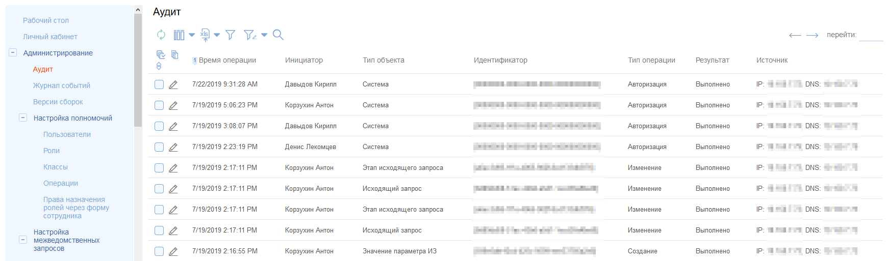

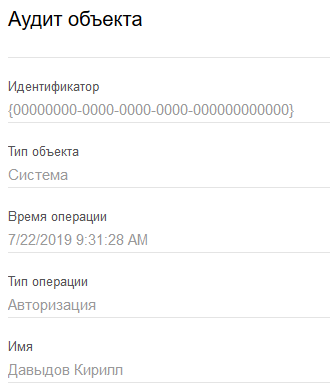

### Журнал событий

Дает информацию о процессах в системе:

* Время;
* Категория;
* Код события;
* Событие;
* Приоритет;
* Серьёзность;
* Сервер;
* Процесс;
* Поток;
* Сообщение;
* Ошибка.

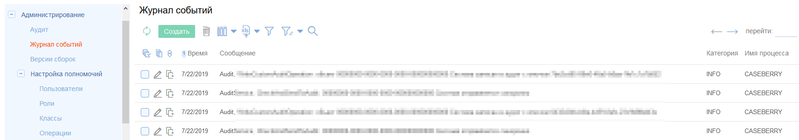

### Версии сборок

Показывает информацию о версиях и времени создания всех установленных компонентов.

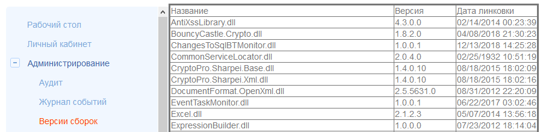

## Настройка полномочий

Позволяет тонко настроить и разграничить уровни доступа. Содержит разделы **Пользователи**, **Роли**, **Классы**, **Операции** и **Назначение ролей**.

### Пользователи

В этом разделе создаются учетные записи пользователей. При редактировании учетной записи пользователя можно назначить ему: **Роли, Группы, Классы и Операции**.

Задаются следующие поля:

* Имя пользователя;
* Логин;
* Пароль;
* Статус активности.

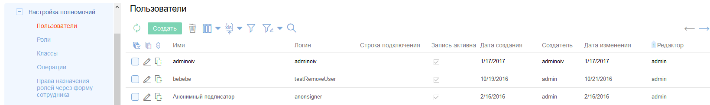

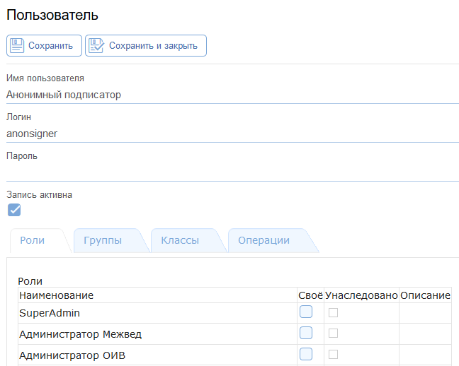

### Роли

Назначаются **Пользователям, Группам, Классам** и **Операциям**.

Можно назначать:

* Название роли;
* Статус активности.

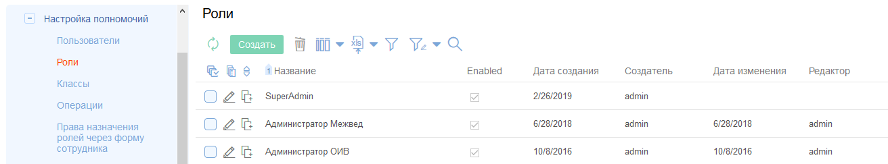

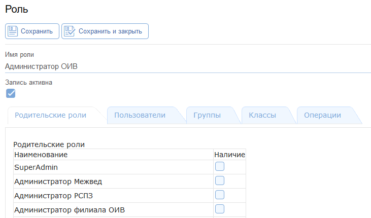

### Классы

С помощью классов можно задавать права роли, пользователя и группы:

* Полный доступ;
* Чтение;
* Вставка;
* Обновление;
* Удаление;
* Исполнение.

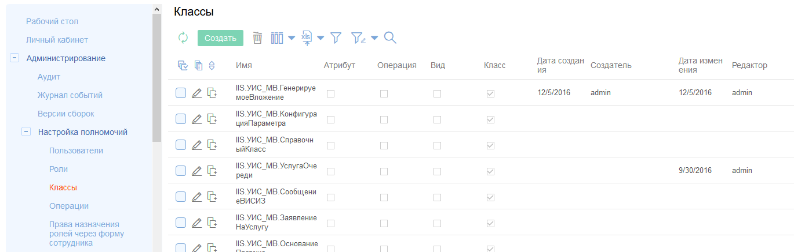

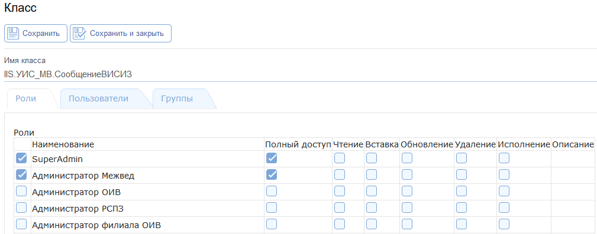

### Операции

Задается набор прав для конкретного действия по роли или пользователю:

* Полный доступ;
* Чтение;
* Вставка;
* Обновление;
* Удаление;
* Исполнение.

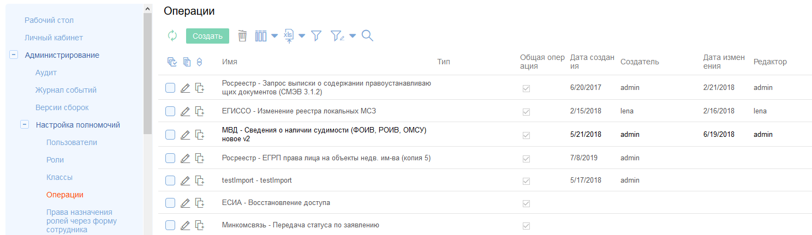

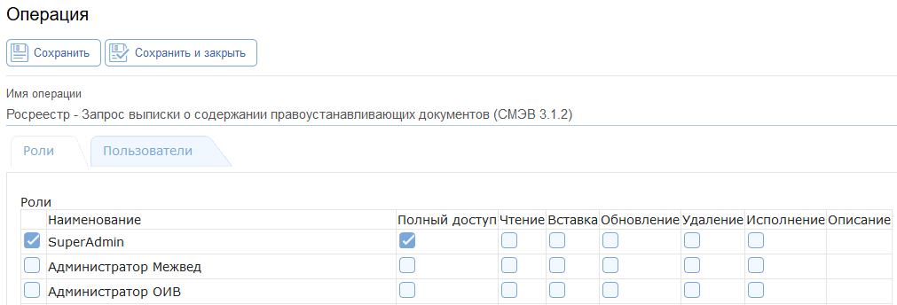

### Назначение ролей

Задаются роли, которые может назначить клиент в форме **Сотрудник**. Можно автоматически назначать определенную роль по умолчанию или включить возможность дополнительно назначить какую-то роль.

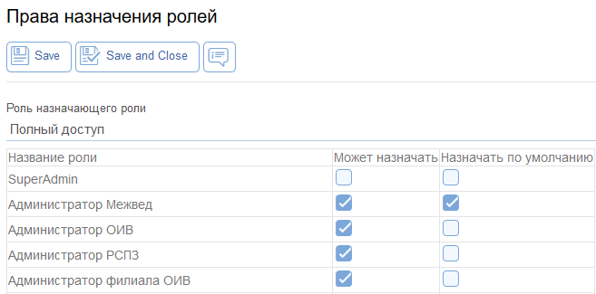
