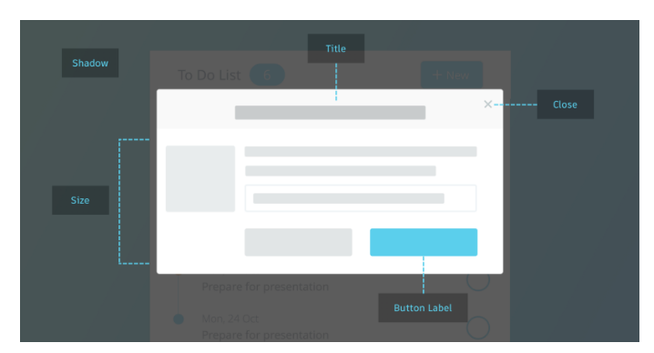
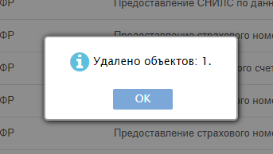
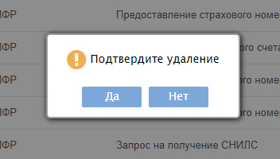

## Диалоги с пользователем

В системе предполагается использование следующих основных способов общения между пользователем и системой:

* Модальные окна
* Всплывающие уведомления
* Всплывающие подсказки (hint)

## Модальное окно

В графическом интерфейсе пользователя модальным называется окно, которое блокирует работу пользователя с родительским приложением до тех пор, пока пользователь не закроет это окно. Модальными преимущественно реализованы диалоговые окна. Также модальные окна часто используются для привлечения внимания пользователя к важному событию или критической ситуации.

[Перенести]: # (Перенести данный абзац вниз к блоку применение)
> Модальные окна необходимо показывать в редких случаях, чаще всего, когда пользователь совершает критическое действие, например, удаляет что-то или вносит значительные изменения. Не следует использовать его для отображения сообщений об ошибке или успешно выполненном действии. В противном случае пользователь приучится автоматически подтверждать свои действия.

Модальное окно должно иметь определенную структуру, примерно, как на картинке ниже:

[Изменить]: # (Как минимум два варианта выходов)
> У него также должно быть несколько выходов:

* Кнопка отмены.
* Крестик в углу.
* По нажатию клавиши Esc.
* При нажатии на свободное пространство вне модального окна.

Кроме того, важно учитывать, что его размеры не должны превышать 50% от пространства всего пользовательского интерфейса, а наименование кнопки целевого действия должно совпадать с заголовком модального окна.

[Перенести]: # (Перенести данный абзац вниз к блоку применение)
> В обычных случаях рекомендуется использовать всплывающие окна, например, при выведении информации о количестве удаленных строк, так как пользователю незачем показывать окно с возможностью нажатия только кнопки «Ок»:
> 
> Как есть (модальное окно):
> 
> 
> 
> Как планируется (всплывающее уведомление):
> 
> 
> 
> Чтобы пользователь мог продолжать непрерывную работу, достаточно просто показать во всплывающем окошке нужную информацию. Оно остается на экране пользователя либо до момента «смахивания», либо висит ограниченное время, после чего исчезает (вообще, в идеале, если бы это пользователь мог сам выбирать).

[Удалить]: # (Убрать данный абзац, который вносит какие то непонятки, а должно иметь руководственный характер написания)
> Также в идеале пользователь должен иметь возможность настраивать расположение всплывающих уведомлений, как, например, это сделано в сервисе Телеграмм, где можно выбрать как место расположения уведомлений, так и их максимальное количество, одновременно выводимое на экран:
> 
> 

## Всплывающее окно
[Добавить]: # (Добавить описание всплывающего окна, что это и как с ним работать)

[Измененить]: # (Изменить заголовок "Использование модального окна" на Применение)
## Использование модального окна

При удалении важных объектов должны выполняться следующие правила:

* Автоматический фокус на кнопке подтверждения должен быть убран
* Информация должна выводиться не только о том, что объекты удаляются, но и о их свойствах и последствиях (особенно в случае, если объекты восстановлению не подлежат)
* Должно быть наличие возможности выхода из неприятного для пользователя состояния

Как это происходит сейчас:

Явный минус в том, что пользователь даже не знает точно, что удаляет, поэтому и подтвердить это действие ему проще. В случае, если бы окно выглядело примерно так, как на рисунке ниже, вероятность, что пользователь до конца осознал свое действие выше:

На этом диалоговом окне присутствует информация об удаляемом объекте, предупреждение об отсутствии обратной силы у данного действия, фокус на кнопке «Нет», а также крестик, который позволит безболезненно выйти из неприятного состояния в случае необходимости.

[Добавить]: # (Добавить заголовок для хинтов и перенести их выше до применения)
## Всплывающая подсказка (Hint)
> Помимо модальных окон и уведомлений для удобства пользователя необходимо реализовать ряд подсказок, например, если кнопка оформлена в виде значка. Также приветствуется, если рядом с описанием кнопки высветится команда быстрого доступа с клавиатуры.
> 
> Выглядит это приблизительно так:
> 
> 
> 
> Другой вид подсказок – подсказки для полноценных кнопок с надписями, если действие, которое они выполняют не очевидно, например:
> 
> 
> 
> При наведении отобразится подсказка:
> 
> 

[Перенести]: # (Перенести данный текст в статью про формы редактирования)
> Также допустимо использовать крупные подсказки, когда действие требует обширного описания:
> 
> 
> При нажатии кнопки «Выписка по счету» в правой части экрана всплывает большое пояснительное уведомление.
>  
> 

[Дописать]: # (Дописать про планшет и телефон)
## В дальнейшем здесь появится раздел по портативным платформам (планшет, смартфон)
