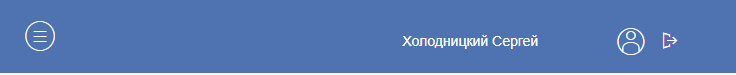
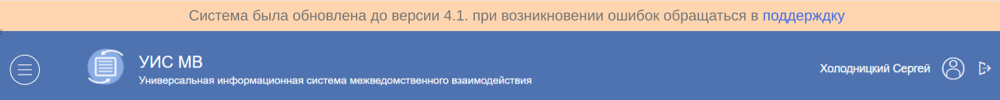
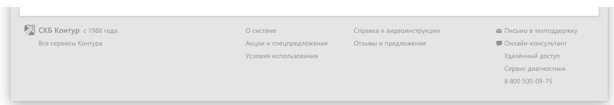
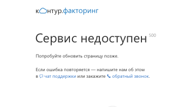
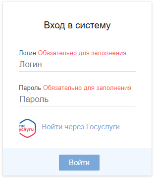

## Шапка

[Заменить]: # (Посмотреть макеты и отобразить все в соответствии с ними)
Шапка приложения – это то, что пользователь будет видеть всегда, значит она должна содержать в себе только самое необходимое, а именно: логотип сервиса, кнопку открытия/закрытия панели навигации, имя авторизованного пользователя, ~~кнопку вызова помощи и кнопку выйти.~~

[Заменить]: # (Выделить шапку для формы авторизацию в отдельный подпукт, прикрепить картинку. Слово "Конечно" - вызывает недопонимание, лучше убрать)
> Конечно, на форме авторизации присутствует только логотип и ничего другого, после авторизации появляются остальные элементы.

Клик по логотипу ведет на главную страницу (рабочий стол), клик по «бутерброду» раскрывает/скрывает панель навигации, клик по имени пользователя перенаправляет в личный кабинет, кнопка помощи перенаправляет на страницу с руководством пользователя и кнопка выйти, соответственно, деавторизовывает пользователя.

Приблизительно так выглядит шапка сейчас:

При сужении страницы логотип исчезает:

На данный момент кнопка «Помощь» отсутствует, но ее присутствие в системе необходимо.

После шапки и перед рабочей панелью присутствует расстояние в 10 пикселей, оно остается при открытии любой страницы.

Если системе необходимо вывести важное уведомление, оно появляется над шапкой и вплотную прилегает к ней, примерно так:

## Подвал

Подвал помогает пользователю найти второстепенные вещи в системе, кроме тогда он делает систему более целостной, поэтому его наличие обязательно. Сейчас подвал отсутствует, но, если бы он был, в нем бы отображалась следующая информация: ссылка на руководство пользователя, письмо в поддержку, ссылка на форму обратной связи, информация о системе (версия и т.д.).

Хороший пример подвала представлен в гайдлайнах СКБ Контур:

Видно, что подвал выполнен в затемненных тонах, присутствует значок логотипа и значки для письма и онлайн консультации, а также полезные ссылки. Подвал отделен от основной страницы невидимой строкой на 10-20 пикселей.

## Ошибки

В сервисе иногда могут происходить ошибки по нескольким причинам:

1. Пользователь зашел на несуществующую (неверную) страницу;
2. Происходит обновление системы;
3. Технические неполадки на сервере или внутри системы.

Для каждой из подобных ошибок необходимо предусмотреть следующее:

* Уведомление об ошибке;
* Способ ее решения;
* Дальнейшие действия пользователя.

При уведомлении об ошибке нельзя показывать технические моменты, например, демонстрировать код эксепшена. Можно указывать код самой ошибки, например 404, ошибка с которой пользователь может быть знаком, для нее можно даже придумать креативную страницу, примеры есть тут: [идеальная страница ошибки](https://habr.com/ru/post/213227/).

О других ошибках необходимо сообщить пользователю на понятном ему языке. Если ошибка временная, предложить зайти на эту страницу позже.

Кроме этого, при возникновении ошибок, которые не мешают продолжить работу с системой, необходимо сохранить элементы на привычных местах (шапка, подвал, панель навигации). Выглядело бы это примерно так:

## Форма входа

Форма входа – важный элемент взаимодействия с пользователем, ведь именно ее он увидит в первую очередь. Она должна быть простой и понятной, чтобы на ней не приходилось долго останавливаться. Хорошим тоном будет, если после одного входа система запомнит логин и пароль.

Приветствуется интеграция с другими сервисами для ускоренного входа (уже реализовано). Обязательно на форме должна присутствовать графа «Восстановить пароль». Также форма входа должна быть выдержана в общей стилистике.

Форма ввода сейчас:

На ней реализованы практически все элементы, кроме кнопки «Восстановить пароль», которая бы давала возможность либо оперативно обратиться к администратору системы, либо иными путями восстановить доступ. Кнопка должна находиться рядом с основной кнопкой «Вход» но должна быть помечена как второстепенная, то есть без заливки только с контуром.
