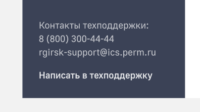
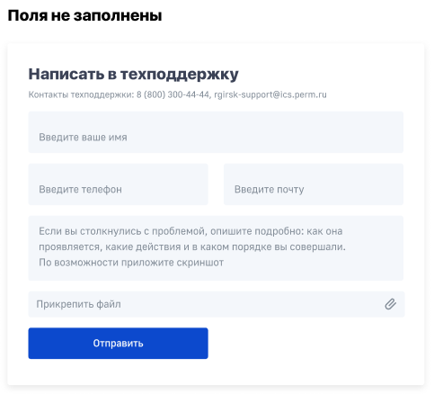
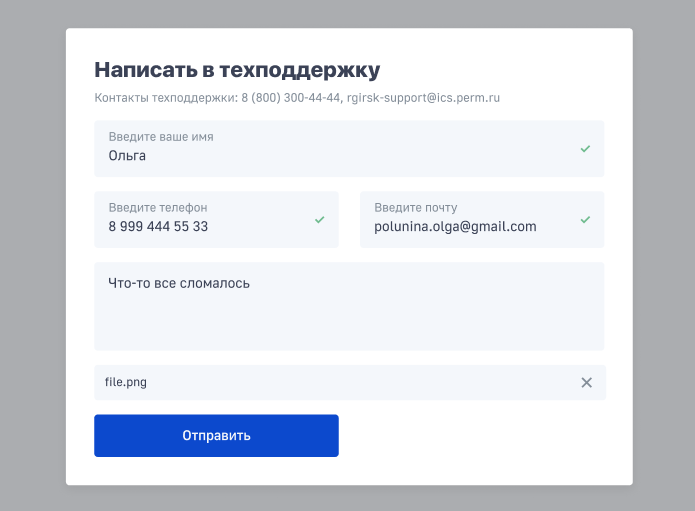
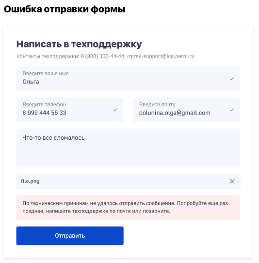
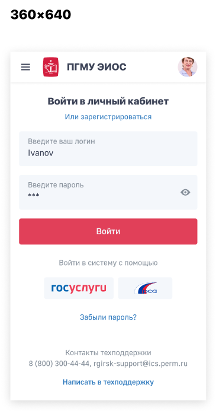
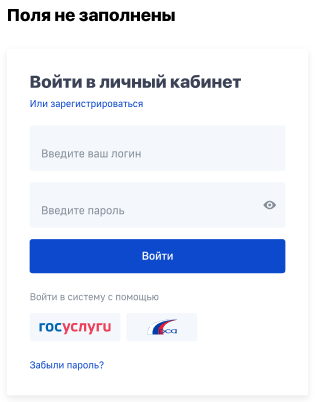
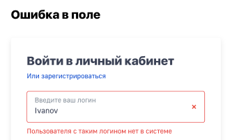
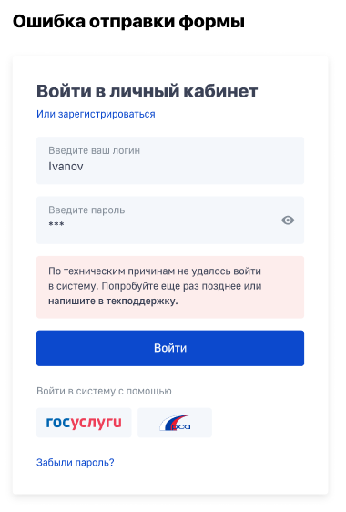
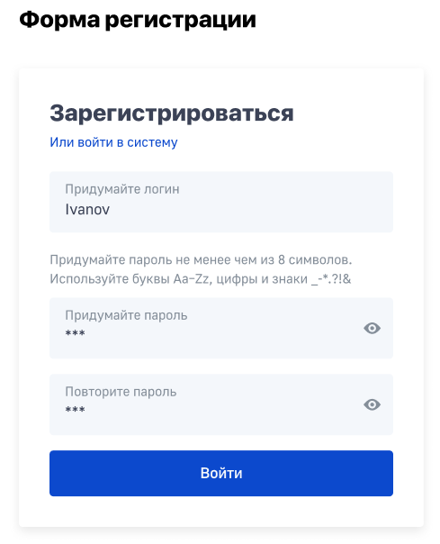

  
## Форма обратной связи

Форма обратной связи является наиболее приемлемым способом общения между администратором ресурса и пользователем. Она существенно экономит время. Это происходит благодаря тому, что человеку, который хочет задать вопрос, не нужно тратить время на запуск почтового клиента, чтобы отправить письмо. Все что требуется – это перейти на форму обратной связи *по ссылке в футере ИС “Написать в техподдержку” (именно там располагается ссылка)*, ввести в предназначенных для этого полях имя пользователя, адрес электронной почты, комментарий, прикрепить файл и нажать кнопку отправки.

Все поля являются обязательными для заполнения, кроме прикрепления файла (отправка формы невозможна без заполнения всех полей, кнопка отправки неактивна).

Форма выглядит следующим образом (элемент Лайтбокс *тут должна быть ссылка на описание данного элемента в FG*):

Форма обратной связи должна быть интерактивна, при возникновении ошибки:

Также ссылка имеется в футере формы авторизации/регистрации. Пример в адаптивной версии:

### Фичи

* При возникновении ошибки ИС автоматически всплывает форма обратной связи с уже заполненными полями «Имя пользователя» и «Информационная система», в поле «Комментарий» копируется вся информация об ошибке, которая необходима разработчику, прикрепляется снимок экрана. Пользователю необходимо лишь заполнить поле «Электронная почта» и добавить в поле «Комментарий» дополнительную информацию.

* Возможность звонка прямо из формы по номеру телефона поддержки (располагается в подвале формы) - больше фича для мобильных версий.

## Форма авторизации и регистрации нового пользователя

### Форма авторизации

Состоит из двух обязательных для заполнения полей – Имя пользователя и Пароль. Кнопка “Войти” неактивна при хотя бы одном пустом поле. Также доступна авторизация через РСАА и ЕСИА.

Ошибка валидации возникает, когда пользователь пытается войти в систему с некорректными данными или при отсутствии пользователя в базе.

Данная форма должна иметь ссылку на регистрацию нового пользователя.

Форма авторизации должна быть также интерактивна – при корректности отправки данных должно появляться уведомление «Авторизация пользователя прошла успешно». При технической ошибке должно появляться уведомление «Авторизация пользователя не выполнена».

### Форма регистрации

Ссылка на форму регистрации нового пользователя должна находится в форме авторизации.

Состоит из двух обязательных для заполнения полей – Имя пользователя и Пароль.

Форма регистрации должна быть интерактивна – при корректности отправки данных должно появляться уведомление «Регистрация пользователя прошла успешно», далее - автоматический переход к форме авторизации. При технической ошибке или при повторной регистрации пользователя должно появляться уведомление «Авторизация пользователя не выполнена».
