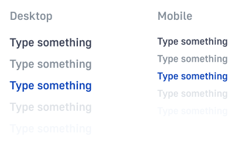
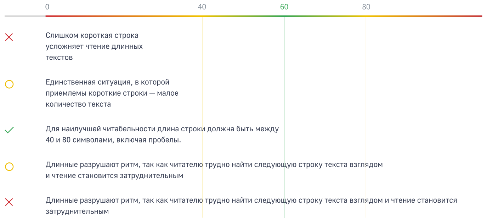
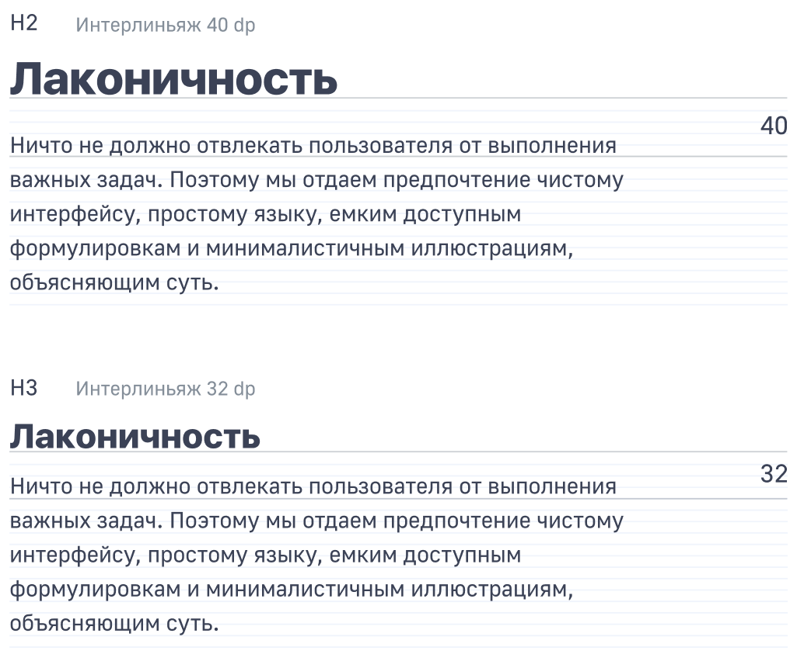
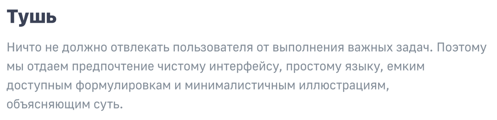
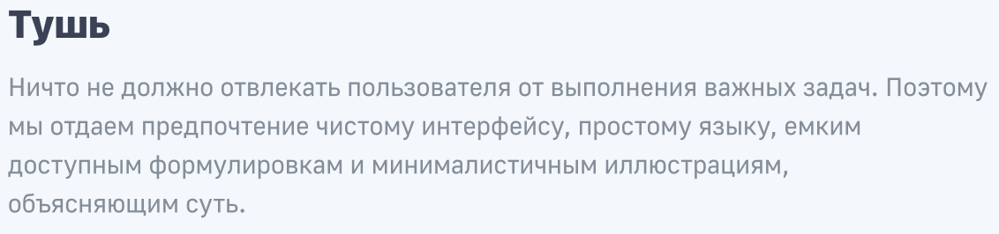
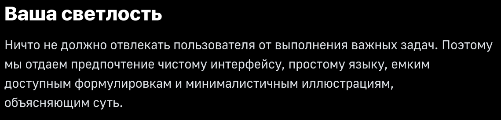
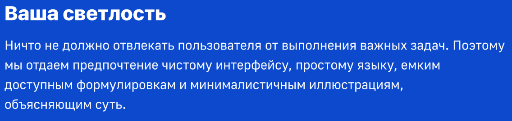

## Десктопная версия

### Светлая тема

### Темная тема

## Мобильная версия

### Светлая тема

### Темная тема

## Теги

## Длина строки

Для глаза читателя, длинные или короткие строки утомительны. Длинные разрушают ритм, так как читателю трудно найти следующую строку текста. Единственная ситуация, в которой приемлемы короткие строки — малое количество текста. Для наилучшей читабельности длина строки должна быть между `40` и `80` символами, включая пробелы.

## Отступы от заголовка

> Есть простое правило для определения оптимального отступа от заголовка до наборного текста. Расстояние между базовыми линиями наборого текста и заголовка равно интерлиньяжу заголовка.

## Контраст с фоном

Доступность цветовых сочетаний можно проверить при помощи [WAVE Evaluation Tool](https://chrome.google.com/webstore/detail/wave-evaluation-tool/jbbplnpkjmmeebjpijfedlgcdilocofh)

Фон: `#FFFFFF`
Цвет шрифта: `#3B4256`

Фон: `#F4F7FB`
Цвет шрифта: `#3B4256`

Фон: `#000000`
Цвет шрифта: `#F4F7FB`

Фон: `#0C49CD`
Цвет шрифта: `#F4F7FB`

