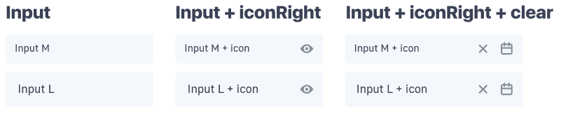
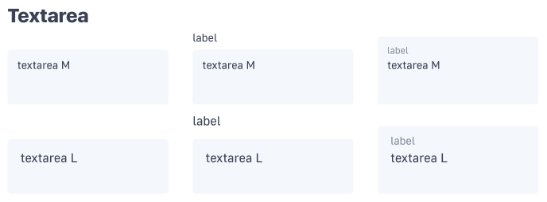
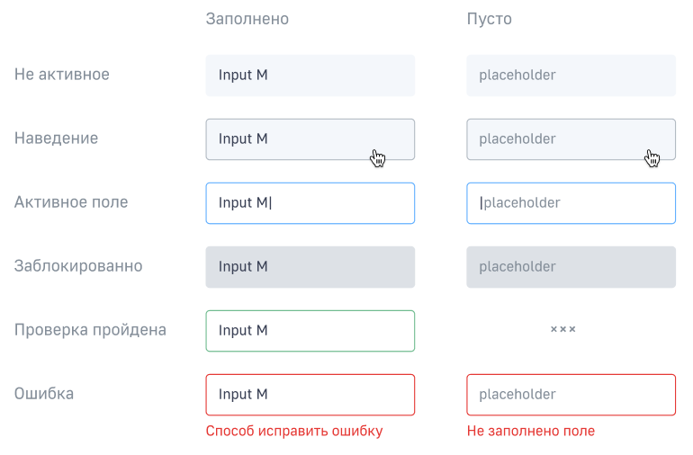
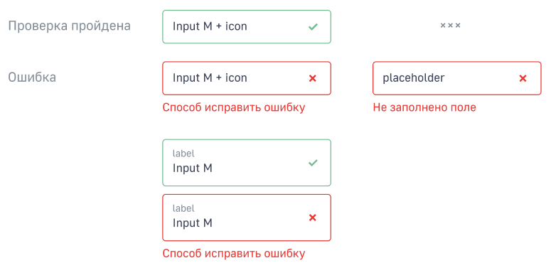
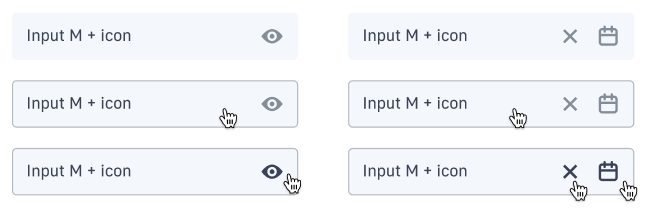
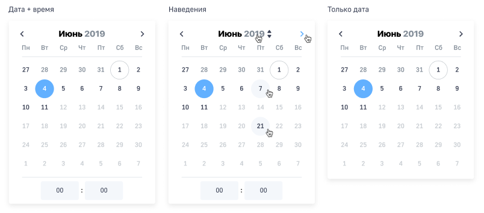
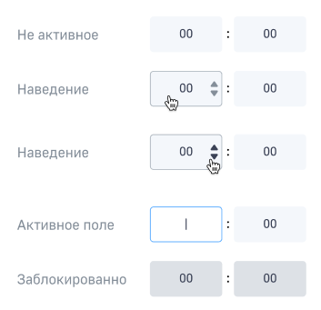

## Базовые поля

В основнм формы вврода делятся на несколько типов.

Поля **M** (средние) в основном используются для второстепенных полей ввода на десктопах. Поля **L** используются для мобильных устройств или в качестве двухстрочных полей.

### Однострочные поля

### Подписанные поля

### Текстовые поля

## Состояния полей

У всех полей есть свои состояния, которые меняются в зависимости от статуса поля, наведения курсаора, активности и т.д.

### Общие состояния

### Особые состояния с валидацией

При проверке поля иконка крестика или галочки может появиться только у однострочного инпута без иконки

### Иконка в поле

## Поля ввода даты и времени

### Поле с датой

TBD

### Календарь

При нажатии на поле со значком даты открывается календарь.

Секция с вводом времени работает следующим образом.

