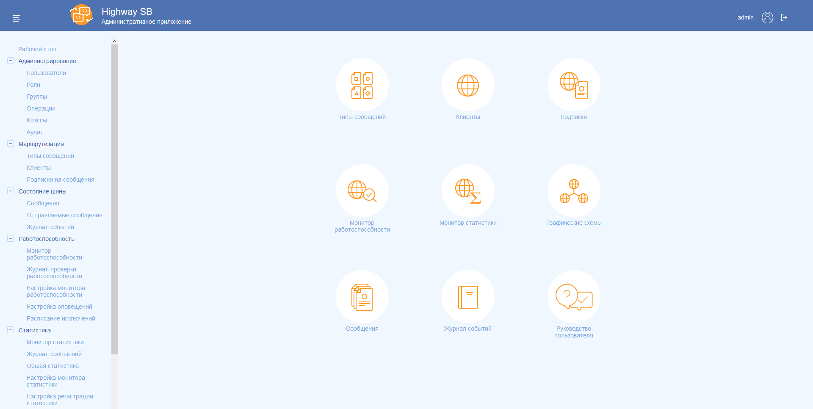

## Основные особенности

В наших системах главная страница меняется в зависимости от привелегий и уровня доступа пользователя. Также есть возможность настроить эту страницу под нужды конкретного заказчика.

В основнм типичная главная страница содержит набор [карточек](uiuxg_cards.ru.md), [иконок-404-](404.md) и небольших [полей ввода](uiuxg_input_fields.ru.md).

> Основные компоненты главной страницы: [Главная страница](uiuxg_main_page.ru)

[УИС МВ](http://dis-riep:2405/ "Внутренняя ссылка"):

[Highway SB](http://dis-int:8080/ "Внутренняя ссылка"):

Прототип АИСОГД:

