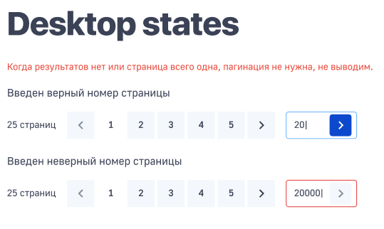
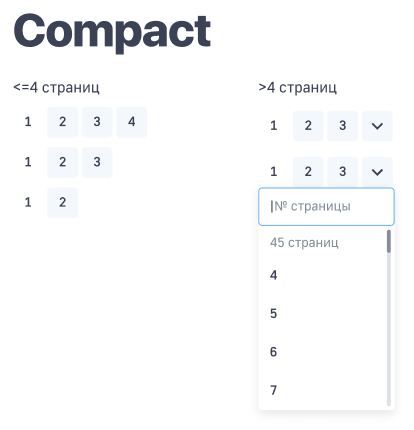
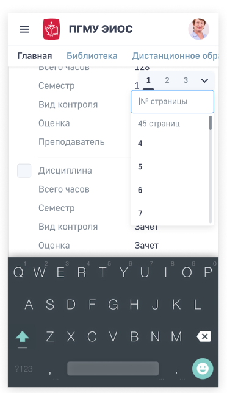
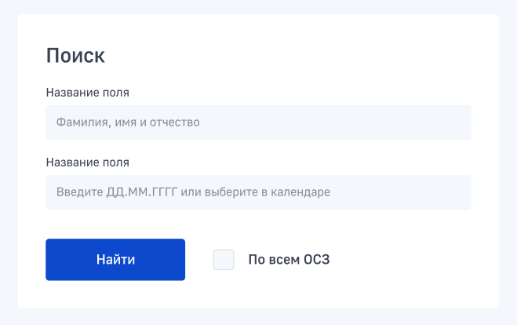
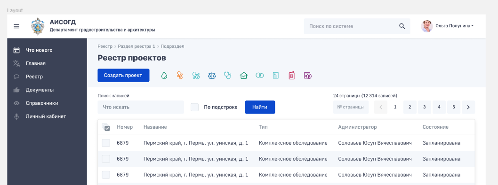
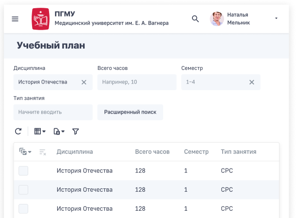
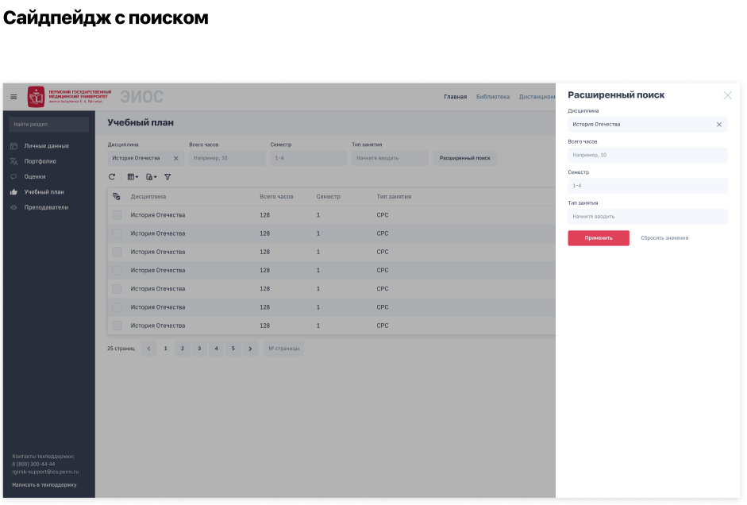
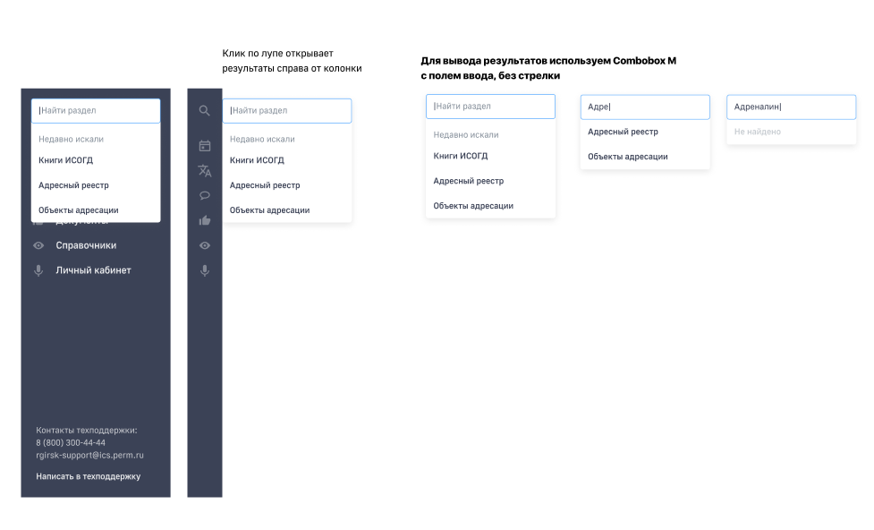

## Поиск страницы в пагинации

Немаловажным элементом является поиск нужной страницы в области пагинации (пейджинга).

Применение для адаптивной версии:

## Поиск, как карточка

Использование поиска в виде формы тоже допустимо (используются поля ввода информации, чек боксы + элемент кнопка. см. соотв. разделы):

## Поиск в списке (+ поисковая панель)

Поиск в списке располагается сверху, как и поисковая панель, отличие - поисковая панель является набором полей ввода (см. элемент Поля ввода) и чекбоксов *(см. элемент Чекбокс)*.

Поисковая панель:

Расширенный поиск:

Поиск в сайтмапе:

